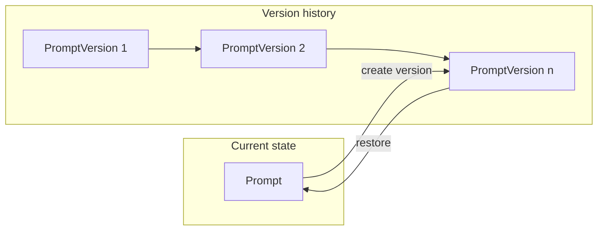

# Prompt Versioning Specification

This document defines all possible features for prompt versioning and the code changes required across models, API routes, storage, and utils. It is the single source of truth for implementing prompt versioning.

---

## 1. Overview and Goals

### Why versioning

- **Audit trail**: See how a prompt evolved over time.
- **Rollback**: Restore a previous version if a change was wrong or experimental.
- **Compare iterations**: Diff two versions to understand what changed.
- **Optional workflow**: Support "published" vs "draft" versions (e.g. tag/label per version).

### Scope

- Versioning applies to **prompts** only (content, title, description; optionally collection_id snapshot).
- **Collections** are unchanged; no collection versioning in this spec.

### Design choice

- The **current prompt** is the working copy (existing `Prompt` model and CRUD).
- **Versions** are **immutable snapshots** created when the prompt is updated (auto or explicit) or when the user explicitly "saves as new version."
- Existing prompt list/get/create/update/patch/delete APIs continue to operate on the current prompt; version endpoints are additive.

---

## 2. Possible Features

All features that can be implemented for prompt versions. Implementation can be phased by priority.

| Priority | Feature | Description |
|----------|---------|--------------|
| **P0** | **Auto-version on update** | On PUT or PATCH, optionally create a new version snapshot **before** applying changes. Caller may pass optional `version_message` or `create_version: true`. |
| **P0** | **List versions** | List all versions for a prompt (e.g. `GET /prompts/{prompt_id}/versions`) with sort (newest first) and optional `limit` / `offset`. |
| **P0** | **Get one version** | Get a single version by version id (e.g. `GET /prompts/{prompt_id}/versions/{version_id}`). Ensures version belongs to the given prompt. |
| **P1** | **Restore / rollback** | Set current prompt's content (and optionally title/description) from a past version. Optionally create a new "restore" version so the rollback itself is recorded. |
| **P1** | **Version metadata** | Per version: optional `message` (changelog), `tag` (e.g. `"v1.0"`), and optionally `status` (e.g. draft/published) or `is_published`. |
| **P2** | **Compare two versions** | Return diff or side-by-side (e.g. content A vs content B) for two versions via something like `GET /prompts/{prompt_id}/versions/compare?from={id1}&to={id2}`. |
| **P2** | **Delete old versions** | Delete a specific version, or support retention policy (e.g. keep last N versions, or prune by age). |
| **P2** | **Save as new version (no edit)** | Explicit endpoint to snapshot the **current** prompt state as a new version (e.g. before a big edit), with optional message/tag. |

---

## 3. Data Model Changes

**File:** [backend/app/models.py](backend/app/models.py)

### New model: `PromptVersion`

Immutable snapshot of a prompt at a point in time.

| Field | Type | Required | Description |
|-------|------|----------|-------------|
| `id` | str | Yes | Unique version id (UUID). |
| `prompt_id` | str | Yes | Parent prompt id. |
| `version_number` | int | Yes | Per-prompt sequence (1, 2, 3, …). |
| `title` | str | Yes | Snapshot of title (1–200 chars). |
| `content` | str | Yes | Snapshot of content (min 1 char). |
| `description` | Optional[str] | No | Snapshot of description (max 500). |
| `collection_id` | Optional[str] | No | Snapshot of collection id. |
| `created_at` | datetime | Yes | When this version was created. |
| `message` | Optional[str] | No | Changelog message (e.g. "Fixed typo"). |
| `tag` | Optional[str] | No | Tag (e.g. `"v1.0"`, `"published"`). |

- Reuse same field constraints as `PromptBase` for `title`, `content`, `description`.
- No `updated_at`; versions are immutable.

### Optional: extend `Prompt`

- **Option A**: Add `current_version_number: Optional[int]` to track the last version number generated for this prompt (so next version is `current_version_number + 1`).
- **Option B**: Derive next version number in storage as `max(version_number)` for that `prompt_id` + 1. No schema change to `Prompt`.

Spec recommends **Option B** to keep `Prompt` unchanged for backward compatibility.

### New request/response models

| Model | Purpose |
|-------|---------|
| `PromptVersionCreate` | Body for "save as new version": optional `message: Optional[str]`, `tag: Optional[str]`. |
| `PromptVersion` | Response model for a single version (fields as in table above). |
| `PromptVersionList` | Response for list: `versions: List[PromptVersion]`, `total: int`. |
| `RestoreVersionRequest` | Body for restore: optional `create_new_version: bool` (default true). |

---

## 4. API / Route Changes

**File:** [backend/app/api.py](backend/app/api.py)

### New routes

| Method | Path | Description | Query / Body | Response |
|--------|------|-------------|--------------|----------|
| GET | `/prompts/{prompt_id}/versions` | List versions for a prompt. | Query: `limit` (optional), `offset` (optional). Sort: newest first. | `PromptVersionList` |
| GET | `/prompts/{prompt_id}/versions/{version_id}` | Get one version. | — | `PromptVersion` (404 if prompt or version missing, or version not for this prompt). |
| POST | `/prompts/{prompt_id}/versions` | Save current prompt state as a new version. | Body: `PromptVersionCreate` (optional message, tag). | `PromptVersion` (201). |
| POST | `/prompts/{prompt_id}/versions/{version_id}/restore` | Restore current prompt from this version. | Body: `RestoreVersionRequest` (optional). | `Prompt` (current prompt after restore). |
| GET | `/prompts/{prompt_id}/versions/compare` | (P2) Compare two versions. | Query: `from={version_id}`, `to={version_id}`. | e.g. `{ "from": {...}, "to": {...}, "diff": "..." }` or similar. |
| DELETE | `/prompts/{prompt_id}/versions/{version_id}` | (P2) Delete one version. | — | 204 No Content. |

### Changes to existing routes

| Route | Change |
|-------|--------|
| `PUT /prompts/{prompt_id}` | Optionally create a version snapshot **before** applying the update. Request body may gain optional `version_message: Optional[str]` and/or `create_version: bool`. If supported, when `create_version=true` (or default), create a version from current state then apply PUT. |
| `PATCH /prompts/{prompt_id}` | Same as PUT: optional version snapshot before apply; optional `version_message` / `create_version` in body. |
| `GET /prompts`, `GET /prompts/{prompt_id}` | No schema change; they return current prompt only. Versions are only via version endpoints. |
| `DELETE /prompts/{prompt_id}` | Must **cascade**: delete all versions for this prompt, then delete the prompt. |

---

## 5. Storage Layer Changes

**File:** [backend/app/storage.py](backend/app/storage.py)

### New structures

- `_prompt_versions: Dict[str, PromptVersion]` — keyed by version `id`.
- `_versions_by_prompt_id: Dict[str, List[str]]` — for each `prompt_id`, ordered list of version ids (e.g. newest first or by version_number) for "list versions" and "next version number."

### New methods

| Method | Signature | Description |
|--------|-----------|-------------|
| `create_prompt_version` | `(self, prompt_id: str, snapshot: PromptVersion) -> PromptVersion` | Append snapshot to `_prompt_versions` and to `_versions_by_prompt_id[prompt_id]`. Compute `version_number` as `len(_versions_by_prompt_id[prompt_id])` before append, or max existing + 1. |
| `get_prompt_version` | `(self, version_id: str) -> Optional[PromptVersion]` | Return version by id. |
| `get_versions_for_prompt` | `(self, prompt_id: str, limit: Optional[int] = None, offset: Optional[int] = None) -> List[PromptVersion]` | Return versions for prompt, newest first; apply limit/offset. |
| `get_next_version_number` | `(self, prompt_id: str) -> int` | Return `len(_versions_by_prompt_id.get(prompt_id, [])) + 1` or equivalent. |
| `delete_prompt_version` | `(self, version_id: str) -> bool` | Remove version from `_prompt_versions` and from `_versions_by_prompt_id[prompt_id]`. Return True if removed. |
| `delete_versions_for_prompt` | `(self, prompt_id: str) -> None` | Remove all versions for this prompt (used when prompt is deleted). |

### Changes to existing methods

| Method | Change |
|--------|--------|
| `update_prompt` | No signature change. Caller (e.g. API layer) may call `create_prompt_version` before `update_prompt` when "create version on update" is desired. |
| `delete_prompt` | Before deleting the prompt, call `delete_versions_for_prompt(prompt_id)`, then delete the prompt. |

---

## 6. Utils Changes

**File:** [backend/app/utils.py](backend/app/utils.py)

### New helpers

| Function | Signature | Description |
|----------|------------|-------------|
| `sort_prompt_versions_by_date` | `(versions: List[PromptVersion], descending: bool = True) -> List[PromptVersion]` | Sort by `created_at` for consistent ordering in list responses. |
| `diff_prompt_content` | (P2) `(content_a: str, content_b: str) -> str` | Return a simple line-based or unified diff for "compare versions" feature. Can use stdlib `difflib.unified_diff` or similar. |

### Existing utils

- `sort_prompts_by_date`, `filter_prompts_by_collection`, `search_prompts`: no change. They operate on current prompts only; versions are not included in prompt list/search in initial scope.

---

## 7. Tests

**File:** [backend/tests/test_api.py](backend/tests/test_api.py) (and optionally a dedicated `tests/test_versions.py` or section in `test_api.py`).

### New test cases (when implementing)

- **Version CRUD**
  - Create version explicitly via `POST /prompts/{id}/versions`; then list and get that version.
  - Create version via update: PATCH with `create_version=true`, then list versions and verify new version exists.
- **Restore**
  - Create prompt, create version, update prompt, then restore from version; assert current prompt matches version content.
- **Cascade**
  - Create prompt, add versions, then `DELETE /prompts/{id}`; assert all versions for that prompt are gone and prompt is deleted.
- **Edge cases**
  - Get version for non-existent prompt → 404.
  - Get version with wrong prompt_id (version exists but for another prompt) → 404.
  - Restore from invalid version_id → 404.
  - List versions for prompt with no versions → 200, empty list.

### Existing tests

- Current prompt CRUD tests should remain unchanged and pass. Version creation on update can be off by default or behind a query/body flag so existing tests do not depend on versioning.

---

## 8. Backward Compatibility

- Existing clients that only use prompt CRUD see **no change** in request/response shape for `GET/POST/PUT/PATCH/DELETE /prompts` and `GET /prompts/{id}`.
- Version endpoints are **additive**; no existing endpoint is removed or changed in a breaking way.
- Optional body fields (`version_message`, `create_version`) on PUT/PATCH are backward compatible when omitted.

---

## 9. Migration (Future)

- If storage is later replaced with a database, an initial migration could:
  - Add a `prompt_versions` table with columns matching `PromptVersion`.
  - Optionally backfill: for each existing prompt, create one "version 1" snapshot from current state so history is non-empty.

---

## 10. Architecture Diagram

- **Prompt**: working copy (existing model).
- **PromptVersion**: immutable snapshots; created on update (optional) or via "save as version"; restore copies version data back to Prompt.

---

## Summary of Code Changes

| Area | File(s) | Changes |
|------|---------|---------|
| **Models** | `backend/app/models.py` | Add `PromptVersion`, `PromptVersionCreate`, `PromptVersionList`, `RestoreVersionRequest`. |
| **Routes** | `backend/app/api.py` | Add version endpoints; optionally extend PUT/PATCH body; cascade delete in `DELETE /prompts/{id}`. |
| **Storage** | `backend/app/storage.py` | Add `_prompt_versions`, `_versions_by_prompt_id`; new methods for version CRUD; `delete_prompt` calls `delete_versions_for_prompt`. |
| **Utils** | `backend/app/utils.py` | Add `sort_prompt_versions_by_date`; optionally `diff_prompt_content` (P2). |
| **Tests** | `backend/tests/test_api.py` (or new file) | Add tests for version list/get, create on update, restore, cascade delete, and edge cases. |
