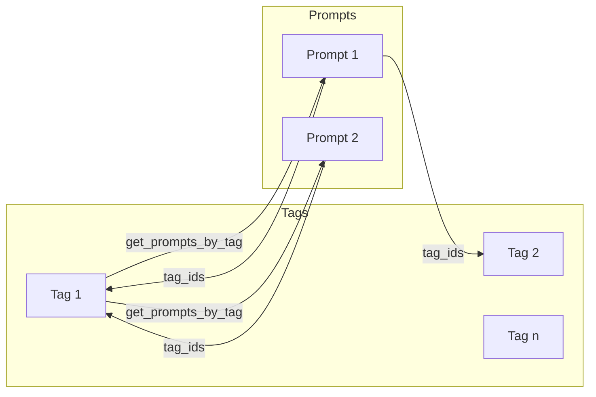

# Tagging System Specification

This document defines all possible features for a tag system for prompt management and the code changes required across models, API routes, storage, and utils. It is the single source of truth for implementing prompt tags.

---

## 1. Overview and Goals

### Why tags

- **Organize prompts beyond collections**: Labels like "summarization", "draft", or "production" can apply across collections.
- **Filter and discover**: Find prompts by tag(s) (e.g. all "draft" prompts).
- **Optional grouping/UI**: Tags can drive UI grouping, badges, or filters.

### Scope

- Tags apply to **prompts** only. Many-to-many: a prompt can have multiple tags; a tag can be attached to multiple prompts.
- **Collections** are unchanged; no collection tagging in this spec.

### Design choice

- **First-class Tag entity**: Tags have an id, name, and optional metadata (description, color). They are stored and managed independently; prompts reference them by `tag_ids`.
- **Alternative (simpler)**: Inline `tags: List[str]` on the Prompt model only — no global tag list or rename. This spec describes the first-class Tag approach as primary and mentions the inline alternative where relevant.

---

## 2. Possible Features

All features that can be implemented for the tag system. Implementation can be phased by priority. P0 is recommended for MVP.

| Priority | Feature | Description |
|----------|---------|-------------|
| **P0** | **Create tag** | Create a named tag (e.g. `POST /tags` with `name`). Optional: slug, normalization (lowercase, trim). |
| **P0** | **List tags** | List all tags (e.g. `GET /tags`) with optional sort by name or usage count. |
| **P0** | **Get one tag** | Get a tag by id (e.g. `GET /tags/{tag_id}`). |
| **P0** | **Assign tags to prompt** | Add or remove tag(s) to/from a prompt. e.g. `PUT /prompts/{id}/tags` (body: tag_ids) to replace full list, or `POST` to add and `DELETE /prompts/{id}/tags/{tag_id}` to remove one. |
| **P0** | **Filter prompts by tag** | `GET /prompts?tag_ids=id1,id2` with AND or OR semantics (spec defines one default, e.g. AND). |
| **P1** | **Delete tag** | Delete a tag; remove it from all prompts that had it (cascade). |
| **P1** | **Tag metadata** | Optional `description`, `color` (hex or name) for UI. |
| **P2** | **Rename tag** | Update tag name (and slug if present); all prompt associations unchanged. |
| **P2** | **Popular / suggested tags** | List tags by usage count; optional "suggest tags" for a prompt (e.g. by title/description). |
| **P2** | **Bulk assign/remove** | Add or remove multiple tags for a prompt in one request (covered by PUT replace or explicit add/remove endpoints). |

---

## 3. Data Model Changes

**File:** [backend/app/models.py](backend/app/models.py)

### New model: `Tag`

First-class entity for a tag.

| Field | Type | Required | Description |
|-------|------|----------|-------------|
| `id` | str | Yes | Unique tag id (UUID). |
| `name` | str | Yes | Display name; 1–50 characters; unique across tags. |
| `slug` | Optional[str] | No | URL-friendly unique identifier (e.g. derived from name). |
| `description` | Optional[str] | No | Short description; max 200 characters. |
| `color` | Optional[str] | No | Hex (e.g. `#ff0000`) or color name for UI. |
| `created_at` | datetime | No (optional) | When the tag was created; optional for consistency with existing models. |

- Name uniqueness is enforced in storage (or API) when creating/updating.
- Slug can be auto-derived from name (lowercase, replace spaces with `-`) if not provided.

### Prompt–tag relationship

**Option A (recommended)**  
Add `tag_ids: List[str]` to the Prompt model. Store tag references on the prompt; "list prompts by tag" = filter prompts where `tag_id in prompt.tag_ids`.

- Add `tag_ids` to `Prompt` (default `[]`). Optionally add to `PromptBase`, `PromptCreate`, `PromptUpdate`, and `PromptPatch` so tags can be set on create/update.
- Existing clients can ignore `tag_ids`; responses include `tag_ids` when present.

**Option B**  
No change to Prompt schema; store mapping in storage only (e.g. `_prompt_tag_ids: Dict[str, List[str]]`). API returns tags when returning a prompt via a computed field or separate endpoint (e.g. `GET /prompts/{id}/tags`).

Spec recommends **Option A** for simplicity and backward-compatible extension.

### New request/response models

| Model | Purpose |
|-------|---------|
| `TagCreate` | Body for create tag: `name` (required), optional `slug`, `description`, `color`. |
| `TagPatch` | Body for update tag: optional `name`, `description`, `color`. |
| `TagList` | Response for list tags: `tags: List[Tag]`, `total: int`. |
| `AssignTagsRequest` | Body for set prompt tags: `tag_ids: List[str]`. Validate each tag_id exists. |

---

## 4. API / Route Changes

**File:** [backend/app/api.py](backend/app/api.py)

### New routes

| Method | Path | Description | Query / Body | Response |
|--------|------|-------------|--------------|----------|
| GET | `/tags` | List all tags. | Query: optional `sort` (name, usage_count), `limit`, `offset`. | `TagList` |
| GET | `/tags/{tag_id}` | Get one tag. | — | `Tag` (404 if not found). |
| POST | `/tags` | Create a tag. | Body: `TagCreate`. | `Tag` (201). |
| PATCH | `/tags/{tag_id}` | Update tag (name, description, color). | Body: `TagPatch`. | `Tag` |
| DELETE | `/tags/{tag_id}` | Delete tag and remove from all prompts (cascade). | — | 204 No Content. |
| GET | `/prompts/{prompt_id}/tags` | List tags for a prompt. | — | List of `Tag` or `tag_ids` (e.g. `TagList` or `{ "tag_ids": [...] }`). |
| PUT | `/prompts/{prompt_id}/tags` | Set full list of tags for a prompt (replace). | Body: `AssignTagsRequest` (tag_ids). Validate all tag_ids exist. | Updated prompt or 200 + tag list. |
| POST | `/prompts/{prompt_id}/tags` | Add tag(s) to prompt (optional; can use PUT only). | Body: `AssignTagsRequest`. | 200/201. |
| DELETE | `/prompts/{prompt_id}/tags/{tag_id}` | Remove one tag from prompt. | — | 204 No Content. |

### Changes to existing routes

| Route | Change |
|-------|--------|
| `GET /prompts` | Add query param `tag_ids` (e.g. comma-separated: `tag_ids=id1,id2`). Filter prompts that have **all** (AND) of the given tags. Optional query `tag_match=any` for OR semantics. |
| `GET /prompts/{prompt_id}` | Include `tag_ids` in response (and optionally inline `tags: List[Tag]`). |
| `POST /prompts` | Optional `tag_ids` in body (Option A); validate each tag_id exists. |
| `PUT /prompts/{prompt_id}` | Optional `tag_ids` in body; validate if provided. |
| `PATCH /prompts/{prompt_id}` | Optional `tag_ids` in body for partial update of tags; validate if provided. |
| `DELETE /prompts/{prompt_id}` | No cascade to Tag; only the prompt is removed (and its tag associations if stored on prompt). |

---

## 5. Storage Layer Changes

**File:** [backend/app/storage.py](backend/app/storage.py)

### New structures

- `_tags: Dict[str, Tag]` — keyed by tag `id`.
- If **Option A**: Prompt model has `tag_ids`; no separate structure. If **Option B**: `_prompt_tag_ids: Dict[str, List[str]]` (prompt_id -> list of tag_ids).

### New methods

| Method | Signature | Description |
|--------|-----------|-------------|
| `create_tag` | `(self, tag: Tag) -> Tag` | Store tag; enforce unique name (and slug if present). Return stored tag. |
| `get_tag` | `(self, tag_id: str) -> Optional[Tag]` | Return tag by id. |
| `get_tag_by_name` | `(self, name: str) -> Optional[Tag]` | Return tag by name (for uniqueness check). |
| `get_all_tags` | `(self) -> List[Tag]` | Return all tags; optional sort by name or usage. |
| `update_tag` | `(self, tag_id: str, tag: Tag) -> Optional[Tag]` | Update existing tag; return updated or None. |
| `delete_tag` | `(self, tag_id: str) -> bool` | Remove tag and remove tag_id from every prompt's `tag_ids` (Option A) or from `_prompt_tag_ids` (Option B). Return True if removed. |
| `get_tags_for_prompt` | `(self, prompt_id: str) -> List[Tag]` | Resolve prompt's tag_ids to Tag objects; return empty list if prompt has no tags or prompt missing. |
| `set_prompt_tags` | `(self, prompt_id: str, tag_ids: List[str]) -> None` | Set prompt's tag_ids (Option A: update Prompt object; Option B: update _prompt_tag_ids). Caller or storage validates tag_ids exist. |
| `add_prompt_tag` | `(self, prompt_id: str, tag_id: str) -> bool` | Add one tag to prompt; return False if prompt not found or tag not found. |
| `remove_prompt_tag` | `(self, prompt_id: str, tag_id: str) -> bool` | Remove one tag from prompt; return True if removed. |
| `get_prompts_by_tag` | `(self, tag_id: str) -> List[Prompt]` | Return all prompts that have this tag_id in their tag_ids (Option A: filter _prompts; Option B: filter by _prompt_tag_ids). |

### Changes to existing methods

| Method | Change |
|--------|--------|
| `create_prompt` / `update_prompt` | When Prompt has `tag_ids`, API layer (or storage) validates each tag_id exists before storing. |
| `delete_prompt` | If Option B: remove prompt_id from `_prompt_tag_ids`. If Option A: no extra step (tag_ids live on prompt). |
| `clear` | Also clear `_tags` (and `_prompt_tag_ids` if Option B). |

---

## 6. Utils Changes

**File:** [backend/app/utils.py](backend/app/utils.py)

### New helper

| Function | Signature | Description |
|----------|------------|-------------|
| `filter_prompts_by_tags` | `(prompts: List[Prompt], tag_ids: List[str], match_all: bool = True) -> List[Prompt]` | Filter prompts that have **all** (AND) of the given tag_ids when `match_all=True`, or **any** (OR) when `match_all=False`. Prompts must have `tag_ids` attribute. |

### Existing utils

- `sort_prompts_by_date`, `filter_prompts_by_collection`, `search_prompts`: no change. Tag filtering is applied in addition (e.g. in `list_prompts`: after collection and search, apply `filter_prompts_by_tags` when `tag_ids` query param is present).

---

## 7. Tests

**File:** [backend/tests/test_api.py](backend/tests/test_api.py) (or a dedicated `tests/test_tags.py` or section in `test_api.py`).

### New test cases (when implementing)

- **Tag CRUD**: Create tag, list tags, get tag, PATCH tag, DELETE tag.
- **Assign tags to prompt**: PUT or POST tags for a prompt; GET prompt and verify tag_ids; GET /prompts/{id}/tags returns correct tags.
- **Remove tag from prompt**: DELETE /prompts/{id}/tags/{tag_id}; verify tag removed.
- **Filter prompts by tag**: GET /prompts?tag_ids=id1; only prompts with that tag returned; test AND semantics with multiple tag_ids.
- **Delete tag cascades**: Create tag, assign to prompts, DELETE /tags/{id}; verify tag removed and all prompts no longer have that tag_id.
- **Validation**: Assign non-existent tag_id to prompt → 400 Bad Request. Create tag with duplicate name → 409 or 400.
- **Edge cases**: Get tags for non-existent prompt → 404. Remove tag from prompt that doesn't have it → 204 or 404.

### Existing tests

- Current prompt CRUD tests should remain unchanged and pass. Optional `tag_ids` in create/update can be omitted; existing tests do not depend on tags.

---

## 8. Backward Compatibility

- Existing clients can ignore `tag_ids` in prompt responses; new field is additive.
- New query param `tag_ids` on `GET /prompts` is optional; omitted behavior unchanged (no tag filtering).
- New tag endpoints are additive; no existing endpoint is removed or changed in a breaking way.
- Prompt create/update body with optional `tag_ids` is backward compatible when omitted.

---

## 9. Migration

- When adding `tag_ids` to Prompt, existing prompts get default `tag_ids: []`. No backfill required.
- If storage is later replaced with a database, add a `tags` table and a `prompt_tag` join table (or `tag_ids` column/JSON on prompts); migrate `_tags` and prompt–tag associations.

---

## 10. Architecture Diagram

- **Tag**: First-class entity (id, name, optional description, color).
- **Prompt**: Has `tag_ids: List[str]` (Option A). Many-to-many: a prompt can have many tags; a tag can be on many prompts.
- **Filter flow**: `GET /prompts?tag_ids=...` → filter prompts where prompt has all (or any) of the given tag ids.

---

## Summary of Code Changes

| Area | File(s) | Changes |
|------|---------|---------|
| **Models** | `backend/app/models.py` | Add `Tag`, `TagCreate`, `TagPatch`, `TagList`, `AssignTagsRequest`; add `tag_ids: List[str]` to Prompt (Option A). |
| **Routes** | `backend/app/api.py` | Add tag CRUD endpoints; GET/PUT/DELETE for prompt tags; extend GET /prompts with `tag_ids` filter; optional `tag_ids` in prompt create/update. |
| **Storage** | `backend/app/storage.py` | Add `_tags`; tag CRUD methods; `get_tags_for_prompt`, `set_prompt_tags`, `add_prompt_tag`, `remove_prompt_tag`, `get_prompts_by_tag`; `delete_tag` cascades; `clear` clears tags. |
| **Utils** | `backend/app/utils.py` | Add `filter_prompts_by_tags(prompts, tag_ids, match_all)`. |
| **Tests** | `backend/tests/test_api.py` (or new file) | Add tests for tag CRUD, prompt–tag assignment, filter by tag, cascade delete, validation. |
