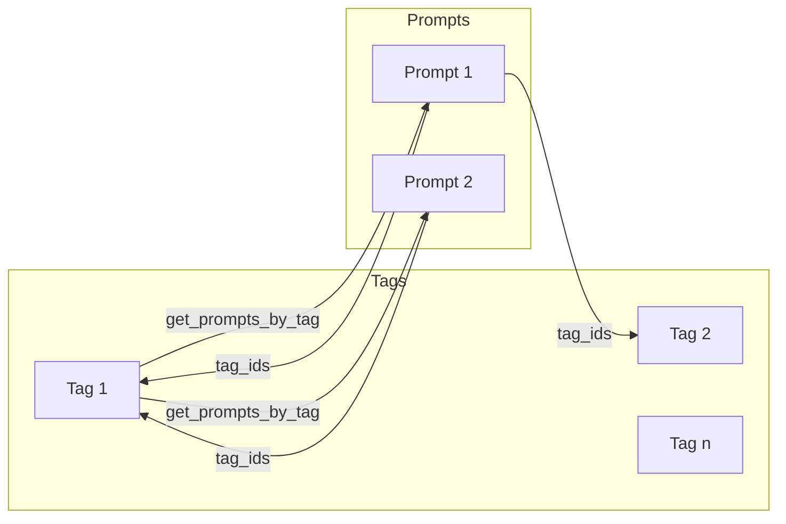

# Tagging System Specification

This document defines all possible features for a tag system for prompt management and the code changes required across models, API routes, storage, and utils. It is the single source of truth for implementing prompt tags.

---

## 1. Overview and Goals

### Why tags

- **Organize prompts beyond collections**: Labels like "summarization", "draft", or "production" can apply across collections.
- **Filter and discover**: Find prompts by tag(s) (e.g. all "draft" prompts).
- **Optional grouping/UI**: Tags can drive UI grouping, badges, or filters.

### Scope

- Tags apply to **prompts** only. Many-to-many: a prompt can have multiple tags; a tag can be attached to multiple prompts.
- **Collections** are unchanged; no collection tagging in this spec.

### Design choice

- **First-class Tag entity**: Tags have an id, name, and optional metadata (description, color). They are stored and managed independently; prompts reference them by `tag_ids`.
- **Alternative (simpler)**: Inline `tags: List[str]` on the Prompt model only — no global tag list or rename. This spec describes the first-class Tag approach as primary and mentions the inline alternative where relevant.

### Goals

- Enable tag CRUD (create, list, get, update, delete) with optional metadata (description, color).
- Enable prompt–tag assignment (set, add, remove tags on a prompt) with validation of tag ids.
- Enable filtering of prompts by one or more tags (AND or OR semantics) with backward compatibility.
- Keep existing prompt and collection APIs unchanged for clients that do not use tags.

---

## 2. User Stories with Acceptance Criteria

### US1: Create a tag

**As a** user, **I want to** create a named tag **so that** I can later assign it to prompts.

**Acceptance criteria:**

- Given a valid tag name (1–50 characters), when I send `POST /tags` with the body `{ "name": "draft", "description": "...", "color": "#ccc" }`, then the API returns **201 Created** and the created tag (with `id`, `name`, optional `slug`, `description`, `color`, `created_at`).
- Given a tag name that already exists, when I send `POST /tags`, then the API returns **400 Bad Request** or **409 Conflict** with a message indicating duplicate name.
- Given an empty or invalid name (e.g. too long), when I send `POST /tags`, then the API returns **422 Unprocessable Entity** with validation details.

### US2: List and get tags

**As a** user, **I want to** list all tags and get a single tag by id **so that** I can browse and reference tags.

**Acceptance criteria:**

- Given one or more tags exist, when I send `GET /tags`, then the API returns **200 OK** with `{ "tags": [...], "total": N }`.
- Given a valid tag id, when I send `GET /tags/{tag_id}`, then the API returns **200 OK** with the tag object.
- Given a non-existent tag id, when I send `GET /tags/{tag_id}`, then the API returns **404 Not Found** with detail `"Tag not found"`.

### US3: Update a tag

**As a** user, **I want to** update a tag’s name, description, or color **so that** I can correct or refine tag metadata without losing prompt associations.

**Acceptance criteria:**

- Given an existing tag, when I send `PATCH /tags/{tag_id}` with `{ "name": "...", "description": "...", "color": "..." }` (all optional), then the API returns **200 OK** with the updated tag.
- Prompt–tag associations remain unchanged after the update.
- Given a non-existent tag id, when I send `PATCH /tags/{tag_id}`, then the API returns **404 Not Found**.

### US4: Assign tags to a prompt

**As a** user, **I want to** set or add tags to a prompt **so that** I can organize and filter prompts by tag.

**Acceptance criteria:**

- Given an existing prompt and existing tag ids, when I send `PUT /prompts/{prompt_id}/tags` with `{ "tag_ids": ["id1", "id2"] }`, then the API returns **200 OK** and the prompt has exactly those tags (replace semantics).
- Given an existing prompt and existing tag ids, when I send `POST /prompts/{prompt_id}/tags` with `{ "tag_ids": ["id1"] }`, then the API adds those tags to the prompt (if not already present) and returns **200** or **201**.
- Given a non-existent tag id in `tag_ids`, when I send `PUT` or `POST` to set/add tags, then the API returns **400 Bad Request** with a message that one or more tag ids are invalid.
- Given a non-existent prompt id, when I send `PUT /prompts/{prompt_id}/tags`, then the API returns **404 Not Found**.

### US5: Remove a tag from a prompt

**As a** user, **I want to** remove a single tag from a prompt **so that** I can correct mistaken assignments.

**Acceptance criteria:**

- Given a prompt that has the tag, when I send `DELETE /prompts/{prompt_id}/tags/{tag_id}`, then the API returns **204 No Content** and the tag is no longer on the prompt.
- Given a prompt that does not have the tag (or tag already removed), when I send `DELETE /prompts/{prompt_id}/tags/{tag_id}`, then the API returns **204 No Content** (idempotent; no error).
- Given a non-existent prompt id, when I send `DELETE /prompts/{prompt_id}/tags/{tag_id}`, then the API returns **404 Not Found**.

### US6: Filter prompts by tags

**As a** user, **I want to** list only prompts that have certain tags **so that** I can find prompts by category or label.

**Acceptance criteria:**

- Given the query `GET /prompts?tag_ids=id1,id2`, when tag_ids are valid, then the API returns **200 OK** with only prompts that have **all** of the given tags (AND semantics).
- Given the optional query `tag_match=any`, when present with `tag_ids`, then the API returns prompts that have **any** of the given tags (OR semantics).
- Given no `tag_ids` query param, when I send `GET /prompts`, then the API returns all prompts (no tag filter); behavior unchanged from current API.

### US7: Delete a tag (cascade)

**As a** user, **I want to** delete a tag **so that** it is removed from the system and from all prompts that had it.

**Acceptance criteria:**

- Given a tag that is assigned to one or more prompts, when I send `DELETE /tags/{tag_id}`, then the API returns **204 No Content**, the tag is deleted, and the tag id is removed from every prompt’s `tag_ids`.
- Given a non-existent tag id, when I send `DELETE /tags/{tag_id}`, then the API returns **404 Not Found**.

### US8: Create or update a prompt with tags

**As a** user, **I want to** set tags when creating or updating a prompt **so that** I can assign tags in one step.

**Acceptance criteria:**

- Given valid prompt data and optional `tag_ids` in the body, when I send `POST /prompts` or `PUT /prompts/{prompt_id}` or `PATCH /prompts/{prompt_id}` with `tag_ids: ["id1", "id2"]`, then the prompt is created/updated with those tags and the API returns **201**/ **200** with the prompt (including `tag_ids`).
- Given a non-existent tag id in `tag_ids`, when I send create/update, then the API returns **400 Bad Request** and does not create/update the prompt.

---

## 3. Possible Features

All features that can be implemented for the tag system. Implementation can be phased by priority. P0 is recommended for MVP.

| Priority | Feature | Description |
|----------|---------|-------------|
| **P0** | **Create tag** | Create a named tag (e.g. `POST /tags` with `name`). Optional: slug, normalization (lowercase, trim). |
| **P0** | **List tags** | List all tags (e.g. `GET /tags`) with optional sort by name or usage count. |
| **P0** | **Get one tag** | Get a tag by id (e.g. `GET /tags/{tag_id}`). |
| **P0** | **Assign tags to prompt** | Add or remove tag(s) to/from a prompt. e.g. `PUT /prompts/{id}/tags` (body: tag_ids) to replace full list, or `POST` to add and `DELETE /prompts/{id}/tags/{tag_id}` to remove one. |
| **P0** | **Filter prompts by tag** | `GET /prompts?tag_ids=id1,id2` with AND or OR semantics (spec defines one default, e.g. AND). |
| **P1** | **Delete tag** | Delete a tag; remove it from all prompts that had it (cascade). |
| **P1** | **Tag metadata** | Optional `description`, `color` (hex or name) for UI. |
| **P2** | **Rename tag** | Update tag name (and slug if present); all prompt associations unchanged. |
| **P2** | **Popular / suggested tags** | List tags by usage count; optional "suggest tags" for a prompt (e.g. by title/description). |
| **P2** | **Bulk assign/remove** | Add or remove multiple tags for a prompt in one request (covered by PUT replace or explicit add/remove endpoints). |

---

## 4. Data Model Changes

**File:** [backend/app/models.py](backend/app/models.py)

### New model: `Tag`

First-class entity for a tag.

| Field | Type | Required | Description |
|-------|------|----------|-------------|
| `id` | str | Yes | Unique tag id (UUID). |
| `name` | str | Yes | Display name; 1–50 characters; unique across tags. |
| `slug` | Optional[str] | No | URL-friendly unique identifier (e.g. derived from name). |
| `description` | Optional[str] | No | Short description; max 200 characters. |
| `color` | Optional[str] | No | Hex (e.g. `#ff0000`) or color name for UI. |
| `created_at` | datetime | No (optional) | When the tag was created; optional for consistency with existing models. |

- Name uniqueness is enforced in storage (or API) when creating/updating.
- Slug can be auto-derived from name (lowercase, replace spaces with `-`) if not provided.

### Prompt–tag relationship

**Option A (recommended)**  
Add `tag_ids: List[str]` to the Prompt model. Store tag references on the prompt; "list prompts by tag" = filter prompts where `tag_id in prompt.tag_ids`.

- Add `tag_ids` to `Prompt` (default `[]`). Optionally add to `PromptBase`, `PromptCreate`, `PromptUpdate`, and `PromptPatch` so tags can be set on create/update.
- Existing clients can ignore `tag_ids`; responses include `tag_ids` when present.

**Option B**  
No change to Prompt schema; store mapping in storage only (e.g. `_prompt_tag_ids: Dict[str, List[str]]`). API returns tags when returning a prompt via a computed field or separate endpoint (e.g. `GET /prompts/{id}/tags`).

Spec recommends **Option A** for simplicity and backward-compatible extension.

### New request/response models

| Model | Purpose |
|-------|---------|
| `TagCreate` | Body for create tag: `name` (required), optional `slug`, `description`, `color`. |
| `TagPatch` | Body for update tag: optional `name`, `description`, `color`. |
| `TagList` | Response for list tags: `tags: List[Tag]`, `total: int`. |
| `AssignTagsRequest` | Body for set prompt tags: `tag_ids: List[str]`. Validate each tag_id exists. |

---

## 5. API / Route Changes

**File:** [backend/app/api.py](backend/app/api.py)

### New routes

| Method | Path | Description | Query / Body | Response |
|--------|------|-------------|--------------|----------|
| GET | `/tags` | List all tags. | Query: optional `sort` (name, usage_count), `limit`, `offset`. | `TagList` |
| GET | `/tags/{tag_id}` | Get one tag. | — | `Tag` (404 if not found). |
| POST | `/tags` | Create a tag. | Body: `TagCreate`. | `Tag` (201). |
| PATCH | `/tags/{tag_id}` | Update tag (name, description, color). | Body: `TagPatch`. | `Tag` |
| DELETE | `/tags/{tag_id}` | Delete tag and remove from all prompts (cascade). | — | 204 No Content. |
| GET | `/prompts/{prompt_id}/tags` | List tags for a prompt. | — | List of `Tag` or `tag_ids` (e.g. `TagList` or `{ "tag_ids": [...] }`). |
| PUT | `/prompts/{prompt_id}/tags` | Set full list of tags for a prompt (replace). | Body: `AssignTagsRequest` (tag_ids). Validate all tag_ids exist. | Updated prompt or 200 + tag list. |
| POST | `/prompts/{prompt_id}/tags` | Add tag(s) to prompt (optional; can use PUT only). | Body: `AssignTagsRequest`. | 200/201. |
| DELETE | `/prompts/{prompt_id}/tags/{tag_id}` | Remove one tag from prompt. | — | 204 No Content. |

### Changes to existing routes

| Route | Change |
|-------|--------|
| `GET /prompts` | Add query param `tag_ids` (e.g. comma-separated: `tag_ids=id1,id2`). Filter prompts that have **all** (AND) of the given tags. Optional query `tag_match=any` for OR semantics. |
| `GET /prompts/{prompt_id}` | Include `tag_ids` in response (and optionally inline `tags: List[Tag]`). |
| `POST /prompts` | Optional `tag_ids` in body (Option A); validate each tag_id exists. |
| `PUT /prompts/{prompt_id}` | Optional `tag_ids` in body; validate if provided. |
| `PATCH /prompts/{prompt_id}` | Optional `tag_ids` in body for partial update of tags; validate if provided. |
| `DELETE /prompts/{prompt_id}` | No cascade to Tag; only the prompt is removed (and its tag associations if stored on prompt). |

### Request and response examples

**POST /tags** — Create a tag

- **Request body:** `{ "name": "draft", "description": "Work in progress", "color": "#cccccc" }` (only `name` required; `slug`, `description`, `color` optional)
- **Response 201:** `{ "id": "uuid", "name": "draft", "slug": "draft", "description": "Work in progress", "color": "#cccccc", "created_at": "2026-02-19T12:00:00" }`

**GET /tags** — List tags

- **Response 200:** `{ "tags": [ { "id": "uuid", "name": "draft", "slug": "draft", "description": null, "color": "#ccc", "created_at": "..." } ], "total": 1 }`

**GET /tags/{tag_id}** — Get one tag

- **Response 200:** `{ "id": "uuid", "name": "draft", "slug": "draft", "description": null, "color": "#ccc", "created_at": "..." }`
- **Response 404:** `{ "detail": "Tag not found" }`

**PATCH /tags/{tag_id}** — Update tag

- **Request body:** `{ "name": "Draft", "description": "Updated", "color": "#999" }` (all fields optional)
- **Response 200:** Full tag object as in GET /tags/{tag_id}

**DELETE /tags/{tag_id}** — Delete tag

- **Request body:** None
- **Response 204:** No content

**GET /prompts/{prompt_id}/tags** — List tags for a prompt

- **Response 200:** `{ "tags": [ { "id": "uuid", "name": "draft", ... } ], "total": 1 }` or alternatively `{ "tag_ids": ["uuid1", "uuid2"] }`
- **Response 404:** `{ "detail": "Prompt not found" }` if prompt_id does not exist

**PUT /prompts/{prompt_id}/tags** — Set full list of tags (replace)

- **Request body:** `{ "tag_ids": ["tag-uuid-1", "tag-uuid-2"] }`
- **Response 200:** Updated list of tags or prompt with `tag_ids`; e.g. `{ "tags": [...] }` or prompt object including `tag_ids`
- **Response 400:** `{ "detail": "One or more tag ids not found" }` if any tag_id is invalid
- **Response 404:** `{ "detail": "Prompt not found" }` if prompt_id does not exist

**POST /prompts/{prompt_id}/tags** — Add tag(s) to prompt

- **Request body:** `{ "tag_ids": ["tag-uuid-1"] }`
- **Response 200 or 201:** Tag list or prompt with updated tags

**DELETE /prompts/{prompt_id}/tags/{tag_id}** — Remove one tag from prompt

- **Request body:** None
- **Response 204:** No content (idempotent if tag was already not on prompt)
- **Response 404:** `{ "detail": "Prompt not found" }` if prompt_id does not exist

**GET /prompts?tag_ids=id1,id2** — Filter prompts by tags

- **Response 200:** Same shape as existing `GET /prompts`: `{ "prompts": [...], "total": N }` with only prompts that have all of the given tag ids (AND). Each prompt includes `tag_ids` if Option A.

---

## 6. Edge Cases Considered

### Validation

- **Empty or invalid tag name:** Name with length 0 or over 50 characters → **422 Unprocessable Entity** with validation detail. Empty string after trim → 422.
- **Invalid or non-existent tag_id:** When assigning tags to a prompt, if any value in `tag_ids` is not a valid UUID or does not exist in storage → **400 Bad Request** with message that one or more tag ids are invalid. Request is rejected; prompt is not updated.
- **Duplicate tag name:** Creating or updating a tag with a `name` that already exists (case-insensitive or as-defined) → **400 Bad Request** or **409 Conflict**. Spec recommends 409 for create and 400/409 for PATCH when name conflicts.
- **Empty or invalid tag_ids in body:** `PUT /prompts/{id}/tags` with `tag_ids: []` is valid → prompt has no tags (200). Malformed JSON or non-array → 422.

### Not found

- **GET /tags/{tag_id}, PATCH /tags/{tag_id}, DELETE /tags/{tag_id}** with non-existent `tag_id` → **404 Not Found** with `detail: "Tag not found"`.
- **GET /prompts/{prompt_id}/tags, PUT /prompts/{prompt_id}/tags, DELETE /prompts/{prompt_id}/tags/{tag_id}** with non-existent `prompt_id` → **404 Not Found** with `detail: "Prompt not found"`.
- **GET /prompts/{prompt_id}** with non-existent `prompt_id` → 404 (unchanged); response when found includes `tag_ids`.

### Idempotency / no-op

- **Remove tag from prompt that doesn’t have it:** `DELETE /prompts/{prompt_id}/tags/{tag_id}` when the prompt does not have that tag → **204 No Content** (idempotent; no error). Alternative: 404 if “resource” is interpreted as the assignment; spec recommends **204** for consistency.
- **Set prompt tags to same list:** `PUT /prompts/{prompt_id}/tags` with the same `tag_ids` the prompt already has → **200 OK**; no state change.

### Cascade

- **Delete tag:** When a tag is deleted, it is removed from every prompt that had it. Prompts are not deleted; only the tag_id is removed from each prompt’s `tag_ids`. No orphaned references.
- **Delete prompt:** When a prompt is deleted, its tag associations are removed (tag_ids on the prompt are gone). Tags themselves are not deleted. No cascade from prompt to Tag.

### Empty inputs

- **GET /prompts?tag_ids=** (empty value or missing): If `tag_ids` is omitted → no tag filter; return all prompts (current behavior). If `tag_ids` is present but empty (e.g. `tag_ids=`) → treat as “no tag filter” and return all prompts, or **400**; spec recommends **no filter** (return all) for empty `tag_ids`.
- **PUT /prompts/{prompt_id}/tags** with `tag_ids: []` → prompt has no tags; **200 OK**.
- **List tags for prompt with no tags:** `GET /prompts/{prompt_id}/tags` when prompt has no tags → **200 OK** with `{ "tags": [], "total": 0 }` or `{ "tag_ids": [] }`.

### Concurrency (optional)

- **Duplicate tag name on create:** If two requests create a tag with the same name, one succeeds (201) and the other returns **409 Conflict** (or 400). Enforce unique name in storage/API.

---

## 7. Storage Layer Changes

**File:** [backend/app/storage.py](backend/app/storage.py)

### New structures

- `_tags: Dict[str, Tag]` — keyed by tag `id`.
- If **Option A**: Prompt model has `tag_ids`; no separate structure. If **Option B**: `_prompt_tag_ids: Dict[str, List[str]]` (prompt_id -> list of tag_ids).

### New methods

| Method | Signature | Description |
|--------|-----------|-------------|
| `create_tag` | `(self, tag: Tag) -> Tag` | Store tag; enforce unique name (and slug if present). Return stored tag. |
| `get_tag` | `(self, tag_id: str) -> Optional[Tag]` | Return tag by id. |
| `get_tag_by_name` | `(self, name: str) -> Optional[Tag]` | Return tag by name (for uniqueness check). |
| `get_all_tags` | `(self) -> List[Tag]` | Return all tags; optional sort by name or usage. |
| `update_tag` | `(self, tag_id: str, tag: Tag) -> Optional[Tag]` | Update existing tag; return updated or None. |
| `delete_tag` | `(self, tag_id: str) -> bool` | Remove tag and remove tag_id from every prompt's `tag_ids` (Option A) or from `_prompt_tag_ids` (Option B). Return True if removed. |
| `get_tags_for_prompt` | `(self, prompt_id: str) -> List[Tag]` | Resolve prompt's tag_ids to Tag objects; return empty list if prompt has no tags or prompt missing. |
| `set_prompt_tags` | `(self, prompt_id: str, tag_ids: List[str]) -> None` | Set prompt's tag_ids (Option A: update Prompt object; Option B: update _prompt_tag_ids). Caller or storage validates tag_ids exist. |
| `add_prompt_tag` | `(self, prompt_id: str, tag_id: str) -> bool` | Add one tag to prompt; return False if prompt not found or tag not found. |
| `remove_prompt_tag` | `(self, prompt_id: str, tag_id: str) -> bool` | Remove one tag from prompt; return True if removed. |
| `get_prompts_by_tag` | `(self, tag_id: str) -> List[Prompt]` | Return all prompts that have this tag_id in their tag_ids (Option A: filter _prompts; Option B: filter by _prompt_tag_ids). |

### Changes to existing methods

| Method | Change |
|--------|--------|
| `create_prompt` / `update_prompt` | When Prompt has `tag_ids`, API layer (or storage) validates each tag_id exists before storing. |
| `delete_prompt` | If Option B: remove prompt_id from `_prompt_tag_ids`. If Option A: no extra step (tag_ids live on prompt). |
| `clear` | Also clear `_tags` (and `_prompt_tag_ids` if Option B). |

---

## 8. Utils Changes

**File:** [backend/app/utils.py](backend/app/utils.py)

### New helper

| Function | Signature | Description |
|----------|------------|-------------|
| `filter_prompts_by_tags` | `(prompts: List[Prompt], tag_ids: List[str], match_all: bool = True) -> List[Prompt]` | Filter prompts that have **all** (AND) of the given tag_ids when `match_all=True`, or **any** (OR) when `match_all=False`. Prompts must have `tag_ids` attribute. |

### Existing utils

- `sort_prompts_by_date`, `filter_prompts_by_collection`, `search_prompts`: no change. Tag filtering is applied in addition (e.g. in `list_prompts`: after collection and search, apply `filter_prompts_by_tags` when `tag_ids` query param is present).

---

## 9. Tests

**File:** [backend/tests/test_api.py](backend/tests/test_api.py) (or a dedicated `tests/test_tags.py` or section in `test_api.py`).

### New test cases (when implementing)

- **Tag CRUD**: Create tag, list tags, get tag, PATCH tag, DELETE tag.
- **Assign tags to prompt**: PUT or POST tags for a prompt; GET prompt and verify tag_ids; GET /prompts/{id}/tags returns correct tags.
- **Remove tag from prompt**: DELETE /prompts/{id}/tags/{tag_id}; verify tag removed.
- **Filter prompts by tag**: GET /prompts?tag_ids=id1; only prompts with that tag returned; test AND semantics with multiple tag_ids.
- **Delete tag cascades**: Create tag, assign to prompts, DELETE /tags/{id}; verify tag removed and all prompts no longer have that tag_id.
- **Validation**: Assign non-existent tag_id to prompt → 400 Bad Request. Create tag with duplicate name → 409 or 400.
- **Edge cases**: Get tags for non-existent prompt → 404. Remove tag from prompt that doesn't have it → 204 or 404.

### Existing tests

- Current prompt CRUD tests should remain unchanged and pass. Optional `tag_ids` in create/update can be omitted; existing tests do not depend on tags.

---

## 10. Backward Compatibility

- Existing clients can ignore `tag_ids` in prompt responses; new field is additive.
- New query param `tag_ids` on `GET /prompts` is optional; omitted behavior unchanged (no tag filtering).
- New tag endpoints are additive; no existing endpoint is removed or changed in a breaking way.
- Prompt create/update body with optional `tag_ids` is backward compatible when omitted.

---

## 11. Migration

- When adding `tag_ids` to Prompt, existing prompts get default `tag_ids: []`. No backfill required.
- If storage is later replaced with a database, add a `tags` table and a `prompt_tag` join table (or `tag_ids` column/JSON on prompts); migrate `_tags` and prompt–tag associations.

---

## 12. Architecture Diagram

```mermaid
flowchart LR
  subgraph tags [Tags]
    T1[Tag 1]
    T2[Tag 2]
    Tn[Tag n]
  end
  subgraph prompts [Prompts]
    P1[Prompt 1]
    P2[Prompt 2]
  end
  P1 -->|tag_ids| T1
  P1 -->|tag_ids| T2
  P2 -->|tag_ids| T1
  T1 -->|get_prompts_by_tag| P1
  T1 -->|get_prompts_by_tag| P2
```

- **Tag**: First-class entity (id, name, optional description, color).
- **Prompt**: Has `tag_ids: List[str]` (Option A). Many-to-many: a prompt can have many tags; a tag can be on many prompts.
- **Filter flow**: `GET /prompts?tag_ids=...` → filter prompts where prompt has all (or any) of the given tag ids.

---

## Summary of Code Changes

| Area | File(s) | Changes |
|------|---------|---------|
| **Models** | `backend/app/models.py` | Add `Tag`, `TagCreate`, `TagPatch`, `TagList`, `AssignTagsRequest`; add `tag_ids: List[str]` to Prompt (Option A). |
| **Routes** | `backend/app/api.py` | Add tag CRUD endpoints; GET/PUT/DELETE for prompt tags; extend GET /prompts with `tag_ids` filter; optional `tag_ids` in prompt create/update. |
| **Storage** | `backend/app/storage.py` | Add `_tags`; tag CRUD methods; `get_tags_for_prompt`, `set_prompt_tags`, `add_prompt_tag`, `remove_prompt_tag`, `get_prompts_by_tag`; `delete_tag` cascades; `clear` clears tags. |
| **Utils** | `backend/app/utils.py` | Add `filter_prompts_by_tags(prompts, tag_ids, match_all)`. |
| **Tests** | `backend/tests/test_api.py` (or new file) | Add tests for tag CRUD, prompt–tag assignment, filter by tag, cascade delete, validation. |
